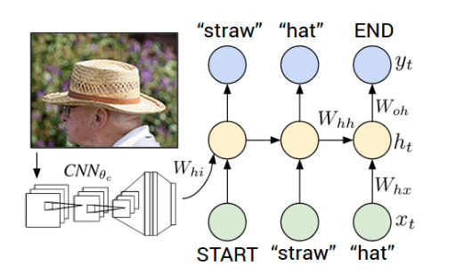

# Image-Captioning
Image Captioning is the process of generating textual description of an image.It uses both Natural language Processing and 
Computer Vision to generate the captions.
The image information is encoded to a vector using a resnet50 model and decoded using LSTM's with a time distributed layer.

## Dataset:
https://www.kaggle.com/shadabhussain/flickr8k

This dataset consists of 8000 images which are further divided into train (6000 images), validation (1000 images) and test(1000 images) 
where each image consists of 5 captions with a similar meaning.

# Network Architecture:

## Encoder
The Convolutional Neural Network(CNN) can be thought of as an encoder. The input image is given to CNN to extract the features. 
The last hidden state of the CNN is connected to the Decoder. I used Resnet50 to encode the images by removing the top layers and fedding
the flatten layer information to the decoder

## Decoder
The Long Short Term Memory(LSTM) which does language modelling up to the word level. The first time step receives the encoded output
from the encoder and also the <START> vector.
 
  
## Training:
The output from the last hidden state of the CNN(Encoder) is given to the first time step of the decoder. We set x1 =<START> vector and the desired label y1 = first word in the sequence. Analogously, we set x2 =word vector of the first word and expect the network to predict the second word. Finally, on the last step, xT = last word, the target label yT =<END> token.

